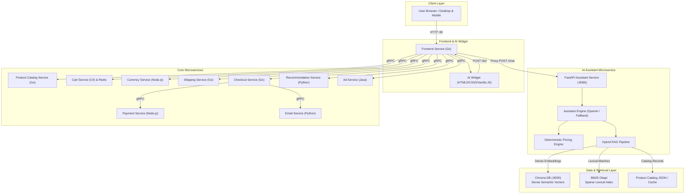
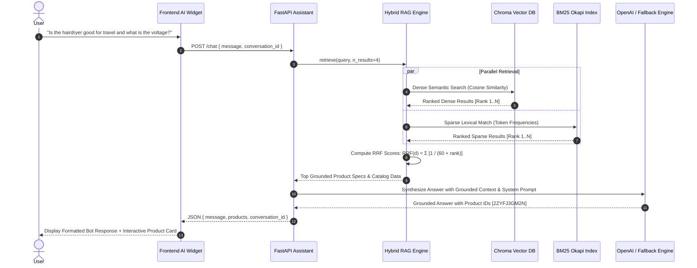

# Microservices AI Forward Deployed Engineering (AI FDE) Platform

<p align="center">
  
</p>

<p align="center">
  <b>Enterprise E-Commerce Microservices Platform powered by an Intelligent Shopping Assistant with Dense + Sparse Hybrid RAG, Chroma Vector Database, and Interactive Frontend UI.</b>
</p>

<p align="center">
  <a href="https://fastapi.tiangolo.com/"></a>
  <a href="https://www.python.org/"></a>
  <a href="https://golang.org/"></a>
  <a href="https://www.trychroma.com/"></a>
  <a href="https://openai.com/"></a>
  <a href="https://docs.docker.com/compose/"></a>
  <a href="https://pytest.org/"></a>
  <a href="LICENSE"></a>
</p>

---

## 📌 Executive Summary

Modern e-commerce architectures demand high-performance microservices coupled with production-grade AI agents capable of answering complex catalog queries with zero hallucination. 

This repository implements a production-grade **AI Forward Deployed Engineering (AI FDE)** platform:
- **FastAPI AI Shopping Assistant**: High-throughput asynchronous service delivering conversational intelligence.
- **Hybrid RAG Pipeline**: Combines dense semantic vector retrieval (Chroma DB) and sparse lexical search (BM25 Okapi) fused with Reciprocal Rank Fusion (RRF).
- **Deterministic Pricing Engine**: Exact monetary calculations for products, quantities, and discounts, eliminating LLM arithmetic hallucination.
- **Interactive Floating Frontend Widget**: Reactive UI embedded seamlessly into the Go boutique frontend, supporting live product cards and suggestion chips.
- **Unified Multi-Service Orchestration**: Docker Compose stack encompassing 12 microservices, Redis caching, Chroma DB, and the AI Assistant.

---

## 🏛️ System Architecture

### 1. High-Level Topology



---

### 2. Hybrid RAG Retrieval Flow

The retrieval engine employs **Reciprocal Rank Fusion (RRF)** to synthesize dense vector embeddings and sparse lexical scores:



---

## 🔬 Core Innovations

### 1. Hybrid Retrieval-Augmented Generation (RAG)
Pure semantic search can miss exact product codes or specific attributes (e.g., "1800W", "dual voltage"), while pure lexical search misses semantic intent (e.g., "warm weather footwear" -> Loafers).

Our Hybrid RAG engine resolves this by fusing both modalities:
- **Dense Retrieval**: Backed by Chroma DB running in containerized mode or in-process with default embeddings.
- **Sparse Retrieval**: Tokenized BM25Okapi index constructed over product titles, descriptions, and enriched technical specifications.
- **Reciprocal Rank Fusion (RRF)**:
  $$\text{RRF\_Score}(d) = \sum_{m \in \{\text{dense}, \text{sparse}\}} \frac{1}{k + \text{rank}_m(d)}$$
  Where $k = 60$ ensures stable score distributions across modalities.

### 2. Deterministic Pricing Engine
To guarantee zero-hallucination in e-commerce monetary interactions:
- Product prices are treated as ground-truth financial records (`units` and `nanos`).
- Direct pricing queries and multi-item quantity calculations bypass unconstrained LLM arithmetic and are computed via deterministic catalog arithmetic.

### 3. Interactive Floating AI Widget
- **No Heavy Dependencies**: Crafted with Vanilla JavaScript and scoped CSS to guarantee instant loading without React/Vue overhead.
- **Dynamic Product Cards**: Automatically extracts bracketed product IDs (e.g., `[OLJCESPC7Z]`) from responses and renders interactive thumbnail cards linking directly to product pages.
- **Contextual Chips**: Preloaded quick-suggestion buttons for instant exploratory inquiries.
- **Session Persistence**: Maintains open/closed state and conversation continuity using browser `sessionStorage`.

---

## 🚀 Quickstart Guide

### Prerequisites
- [Docker](https://docs.docker.com/get-docker/) & [Docker Compose](https://docs.docker.com/compose/install/) (v2.20+)
- Python 3.11+ (for local AI assistant development)
- OpenAI API Key (optional; deterministic fallback engine activates automatically if omitted)

---

### Method A: Full Stack via Docker Compose (Recommended)

Run all 12 microservices, Chroma DB, and the AI Shopping Assistant with one command:

```bash
# 1. Clone the repository
git clone https://github.com/bittush8789/microservices-ai-assistant.git
cd microservices-ai-assistant

# 2. Configure environment (optional OpenAI key)
cp .env.example .env.openai
# Edit .env.openai to add your OPENAI_API_KEY if desired

# 3. Launch the full platform
docker compose up --build
```

Access the services:
- **Online Boutique Frontend**: [http://localhost:80](http://localhost:80)
- **AI Shopping Assistant API**: [http://localhost:8080/docs](http://localhost:8080/docs)
- **Chroma DB Vector Database**: [http://localhost:8000](http://localhost:8000)

---

### Method B: Standalone AI Assistant & Chroma DB (Rapid Development)

If you only want to work on or test the AI Shopping Assistant:

```bash
# 1. Start Chroma DB container
docker compose -f docker-compose.chroma.yaml up -d

# 2. Set up Python virtual environment
cd src/shoppingassistantservice
python -m venv .venv
source .venv/bin/activate   # On Windows: .venv\Scripts\activate

# 3. Install dependencies
pip install -r requirements.txt

# 4. Configure environment
export OPENAI_API_KEY="sk-..."  # On Windows: $env:OPENAI_API_KEY="sk-..."

# 5. Run the FastAPI service
python shoppingassistantservice.py
```

The service will start on `http://localhost:8080` with automatic re-indexing and hot reloading.

---

## 📡 API Reference

Interactive OpenAPI documentation is available at `http://localhost:8080/docs`.

### 1. Chat Completion (`POST /chat`)

Handles multi-turn conversational shopping inquiries.

**Request:**
```json
POST /chat
Content-Type: application/json

{
  "message": "How much does the watch cost and what are its features?",
  "conversation_id": "session-123"
}
```

**Response:**
```json
{
  "message": "The Vintage Typewriter Watch [1YMWWN1N4O] is priced at $109.99 USD.\n\nKey Features & Specifications:\n- Material: Gold-tone ion-plated stainless steel case\n- Features: Japanese quartz movement, water-resistant to 30 meters (3 ATM)\n- Warranty: 2-year international warranty",
  "products": [
    {
      "id": "1YMWWN1N4O",
      "name": "Vintage Typewriter Watch",
      "price_formatted": "$109.99"
    }
  ],
  "conversation_id": "session-123"
}
```

---

### 2. Hybrid RAG Search (`POST /rag/search`)

Direct access to the retrieval engine for debugging and inspection.

**Request:**
```json
POST /rag/search
Content-Type: application/json

{
  "query": "polarized sunglasses for driving",
  "top_k": 3,
  "mode": "hybrid"
}
```

**Response:**
```json
{
  "query": "polarized sunglasses for driving",
  "mode": "hybrid",
  "count": 1,
  "results": [
    {
      "product_id": "OLJCESPC7Z",
      "name": "Sunglasses",
      "price": "$19.99",
      "rrf_score": 0.0328,
      "dense_rank": 1,
      "sparse_rank": 1,
      "strategy": "hybrid_rrf"
    }
  ]
}
```

---

### 3. Monitoring & Health Endpoints

| Endpoint | Method | Purpose |
| :--- | :--- | :--- |
| `/healthz` | `GET` | Readiness and liveness probe checking Chroma DB and catalog connectivity. |
| `/metrics` | `GET` | Prometheus telemetry metrics (request counts, latency histograms). |

---

## 🧪 Testing & Validation

The AI Shopping Assistant features a comprehensive 25-test suite covering:
1. **Catalog Integrity**: Pricing conversions, categories, specifications.
2. **API Contracts**: Input validation, error handling, session persistence.
3. **RAG Retrieval Quality**: Dense accuracy, sparse BM25 keyword matching, RRF fusion scoring.

Execute the test suite:

```bash
# Run all tests with verbose output
python -m pytest src/shoppingassistantservice/tests/ -v
```

**Test Execution Summary:**
```
src/shoppingassistantservice/tests/test_api.py::test_health_check PASSED
src/shoppingassistantservice/tests/test_api.py::test_chat_pricing_query PASSED
src/shoppingassistantservice/tests/test_api.py::test_chat_product_recommendation PASSED
src/shoppingassistantservice/tests/test_catalog.py::test_catalog_loading PASSED
src/shoppingassistantservice/tests/test_catalog.py::test_price_usd_formatting PASSED
src/shoppingassistantservice/tests/test_rag.py::test_bm25_sparse_retrieval PASSED
src/shoppingassistantservice/tests/test_rag.py::test_hybrid_rag_retrieval PASSED
src/shoppingassistantservice/tests/test_rag.py::test_rrf_scoring PASSED
============================== 25 passed in 1.42s ==============================
```

---

## 📦 Microservices Inventory

| Service | Language | Port | Primary Responsibility |
| :--- | :--- | :--- | :--- |
| **shoppingassistantservice** | Python (FastAPI) | `8080` | AI Conversational Agent, Hybrid RAG, Chroma DB integration. |
| **frontend** | Go | `80` | Web store UI with embedded AI Assistant Floating Widget. |
| **chromadb** | Python | `8000` | Vector Database storing dense semantic embeddings. |
| **productcatalogservice** | Go | `3550` | Official product catalog provider (gRPC). |
| **cartservice** | C# | `7070` | Shopping cart storage with Redis backend (gRPC). |
| **currencyservice** | Node.js | `7000` | Foreign exchange rate conversions (gRPC). |
| **paymentservice** | Node.js | `50051`| Payment processing engine (gRPC). |
| **shippingservice** | Go | `50051`| Shipping rate estimation and tracking (gRPC). |
| **checkoutservice** | Go | `5050` | Multi-service checkout orchestration (gRPC). |
| **recommendationservice** | Python | `8080` | Collaborative recommendation engine (gRPC). |
| **emailservice** | Python | `8080` | Order confirmation emails (gRPC). |
| **adservice** | Java | `9555` | Contextual advertisement delivery (gRPC). |

---

## 📁 Directory Structure

```plaintext
microservices-ai-assistant/
├── .github/
│   └── workflows/
│       └── ci.yaml                    # Automated GitHub Actions test pipeline
├── docker-compose.yaml                # Master orchestration for all 12 services + Chroma + AI
├── docker-compose.chroma.yaml         # Standalone Chroma DB vector database
├── .env.example                       # Environment configuration template
├── .gitignore                         # Security filters (ignoring .env*, cache, binaries)
├── LICENSE                            # Apache 2.0 License
├── README.md                          # Platform Documentation
├── protos/                            # Protocol Buffers (gRPC) definitions
└── src/
    ├── frontend/                      # Go Web Frontend
    │   ├── static/styles/bot.css      # AI Assistant Widget Stylesheet
    │   ├── templates/ai_widget.html   # AI Assistant Interactive Modal Template
    │   └── handlers.go                # AI Widget integration flags & endpoints
    ├── shoppingassistantservice/      # AI Assistant Microservice
    │   ├── app/
    │   │   ├── assistant.py           # Multi-turn conversation & prompt engine
    │   │   ├── catalog.py             # Product catalog & pricing manager
    │   │   ├── config.py              # Pydantic environment settings
    │   │   ├── main.py                # FastAPI REST API & Prometheus instrumentation
    │   │   ├── rag.py                 # Hybrid RAG (Chroma Dense + BM25 Sparse + RRF)
    │   │   ├── schemas.py             # Request/Response Pydantic models
    │   │   └── data/
    │   │       └── products.json      # Product catalog source data
    │   ├── tests/                     # 25 automated unit, API, & RAG tests
    │   ├── Dockerfile                 # Container image specification
    │   ├── requirements.txt           # Locked Python dependencies
    │   └── shoppingassistantservice.py# Service entry point
    └── [productcatalogservice, cartservice, currencyservice, ...]
```

---

## 🔒 Security & Best Practices

- **Zero Secret Exposure**: `.gitignore` strictly protects `.env*` and API key configuration files.
- **Stateless & Scalable**: The FastAPI Shopping Assistant service is stateless and can be scaled horizontally behind a load balancer.
- **Fail-Safe Fallback**: If OpenAI API encounters quota limits or network downtime, the assistant smoothly falls back to deterministic retrieval without dropping user requests.

---

## 📄 License

This project is licensed under the Apache License 2.0 - see the [LICENSE](LICENSE) file for details.
