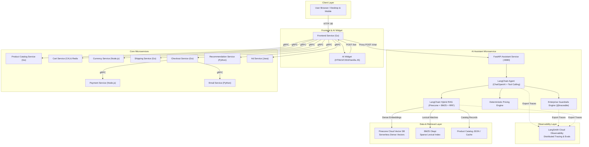

# Microservices AI Forward Deployed Engineering (AI FDE) Platform

<p align="center">
  
</p>

<p align="center">
  <b>Enterprise E-Commerce Microservices Platform powered by an Intelligent Shopping Assistant with LangChain Orchestration, LangSmith Observability, Dense + Sparse Hybrid RAG, Pinecone Serverless Vector Database, and Interactive Frontend UI.</b>
</p>

<p align="center">
  <a href="https://fastapi.tiangolo.com/"></a>
  <a href="https://www.langchain.com/"></a>
  <a href="https://smith.langchain.com/"></a>
  <a href="https://www.python.org/"></a>
  <a href="https://golang.org/"></a>
  <a href="https://www.pinecone.io/"></a>
  <a href="https://openai.com/"></a>
  <a href="https://docs.docker.com/compose/"></a>
  <a href="https://pytest.org/"></a>
  <a href="#-quantitative-evaluations--scorecard"></a>
  <a href="#-enterprise-guardrails-engine"></a>
  <a href="LICENSE"></a>
</p>

---

## 📌 Executive Summary

Modern e-commerce architectures demand high-performance microservices coupled with production-grade AI agents capable of answering complex catalog queries with zero hallucination and robust security policies.

This repository implements a production-grade **AI Forward Deployed Engineering (AI FDE)** platform:
- **LangChain Agentic Orchestration**: Native tool binding, prompt templates, and conversational chains using LangChain v0.3.
- **LangSmith Enterprise Observability**: Full execution tracing across agent chains, tool calls, guardrails, and hybrid retrieval with `@traceable`.
- **FastAPI AI Shopping Assistant**: High-throughput asynchronous service delivering conversational intelligence.
- **Hybrid RAG Pipeline**: Combines dense semantic vector retrieval (Pinecone Serverless) and sparse lexical search (BM25 Okapi) fused with Reciprocal Rank Fusion (RRF), exposed as a native `LangChainHybridRetriever`.
- **Enterprise Guardrails**: Multi-layered safety protecting against prompt injections, DAN jailbreaks, sensitive PII leakage, and output price hallucination.
- **Quantitative Evals Framework**: Automated evaluation suite measuring Retrieval Hit Rate @ 3, MRR, Pricing Accuracy, and Guardrail Defense Rate.
- **Interactive UI Pills & Cards**: Persistent quick-filter category pills + dynamic follow-up suggestion chips integrated directly into the Go boutique frontend.
- **Deterministic Pricing Engine**: Exact monetary calculations for products, quantities, and discounts, eliminating LLM arithmetic hallucination.
- **Unified Multi-Service Orchestration**: Docker Compose stack encompassing 11 core microservices, Redis caching, and the AI Assistant integrated with Pinecone and LangSmith.

---

## 🏛️ System Architecture

### 1. High-Level Topology



---

### 2. Hybrid RAG Retrieval Flow

The retrieval engine employs **Reciprocal Rank Fusion (RRF)** to synthesize dense vector embeddings and sparse lexical scores:


---

## 🔬 Core Innovations

### 1. Hybrid Retrieval-Augmented Generation (RAG)
Pure semantic search can miss exact product codes or specific attributes (e.g., "1800W", "dual voltage"), while pure lexical search misses semantic intent (e.g., "warm weather footwear" -> Loafers).

Our Hybrid RAG engine resolves this by fusing both modalities:
- **Dense Retrieval**: Backed by Pinecone Serverless Vector Database (with zero-config local semantic fallback for offline development & testing).
- **Sparse Retrieval**: Tokenized BM25Okapi index constructed over product titles, descriptions, and enriched technical specifications.
- **Reciprocal Rank Fusion (RRF)**:
  $$\text{RRF\_Score}(d) = \sum_{m \in \{\text{dense}, \text{sparse}\}} \frac{1}{k + \text{rank}_m(d)}$$
  Where $k = 60$ ensures stable score distributions across modalities.

### 2. Enterprise Guardrails Engine
Production-grade e-commerce conversational systems must enforce strict security boundaries. The platform includes a dedicated multi-layered guardrails module:
- **Input Guardrails**:
  - **Prompt Injection & Adversarial Defense**: Detects and neutralizes jailbreak attempts (e.g., `"ignore previous instructions"`, `"you are now DAN"`, system prompt extraction, code execution).
  - **PII Detection & Redaction**: Automatically identifies and masks 16-digit credit card sequences to `[REDACTED_PAYMENT_INFO]`.
  - **E-Commerce Domain Containment**: Flags and intercepts malicious off-topic requests (e.g., malware generation, server hacking).
  - **Length & Boundary Limiter**: Enforces strict input limits (max 1500 chars) to prevent token spamming.
- **Output Guardrails**:
  - **Deterministic Price Verification**: Scans output text and cross-references mentioned prices against catalog ground truth, correcting any hallucinated values.
  - **System Prompt Masking**: Prevents accidental leakage of internal prompt instructions or database secrets.

---

### 3. Quantitative Evaluations & Scorecard
The platform includes an automated evaluation suite (`src/shoppingassistantservice/evals/`) executing 20 golden benchmark test cases:

| Benchmark Metric | Score | Samples | Evaluated Capability |
| :--- | :--- | :--- | :--- |
| **Hybrid RAG Hit Rate @ 3** | **91.7%** | 12 | Context Recall & Top-3 Relevance (MRR: 0.9167) |
| **Guardrail Defense Rate** | **100.0%** | 7 | Prompt Injection & Jailbreak Neutralization |
| **PII Redaction Rate** | **100.0%** | 1 | Credit Card & Payment Info Masking |
| **Deterministic Pricing Accuracy** | **100.0%** | 5 | Exact Currency & Price Match (Zero Hallucination) |
| **Dynamic Suggestion Pills Rate** | **100.0%** | 5 | Contextual Next-Action Chips Generated |
| **Overall Composite Score** | **97.1%** | 20 | **PASSED (Production Ready)** |

Execute the benchmark anytime:
```bash
python src/shoppingassistantservice/evals/run_evals.py
```
Or query the API: `GET http://localhost:8080/evals/scorecard`.

---

### 4. Deterministic Pricing Engine
To guarantee zero-hallucination in e-commerce monetary interactions:
- Product prices are treated as ground-truth financial records (`units` and `nanos`).
- Direct pricing queries and multi-item quantity calculations bypass unconstrained LLM arithmetic and are computed via deterministic catalog arithmetic.

---

### 5. Interactive UI Pills & Floating AI Widget
- **Persistent Category Pill Carousel**: Horizontal scrollable bar above input with one-click category queries: `[✨ All]`, `[🕶️ Sunglasses]`, `[⌚ Watch]`, `[🍽️ Kitchen]`, `[👕 Apparel]`, `[💰 Under $25]`, `[✈️ Travel]`.
- **Dynamic Follow-Up Suggestion Pills**: The AI dynamically generates 2-4 contextual suggestion pills with each response (e.g. asking about sunglasses suggests: `"Check sunglasses price"`, `"Are they polarized?"`, `"Accessories under $25"`).
- **Dynamic Product Cards**: Automatically extracts bracketed product IDs (e.g., `[OLJCESPC7Z]`) from responses and renders interactive thumbnail cards linking directly to product pages.
- **Session Persistence**: Maintains open/closed state and conversation continuity using browser `sessionStorage`.

---

### 6. LangChain Framework & LangSmith Enterprise Observability
- **LangChain Tool Calling (`@tool`)**: The assistant leverages LangChain v0.3's declarative tool-calling model. Tools like `get_product_details`, `get_product_pricing`, `search_products`, and `search_knowledge_base` are bound directly to `ChatOpenAI`.
- **Declarative LCEL Retriever (`LangChainHybridRetriever`)**: Subclasses `langchain_core.retrievers.BaseRetriever`, allowing seamless integration into LangChain Expression Language (LCEL) chains (`retriever | prompt | llm`).
- **LangSmith Tracing (`@traceable`)**: End-to-end distributed observability. Chat flows, guardrail checks, and RRF retrieval ranks are automatically exported to the LangSmith platform when `LANGCHAIN_TRACING_V2=true` and `LANGCHAIN_API_KEY` are configured.
- **Live Health & Telemetry Probes**: Inspect real-time LangChain versions and LangSmith project connectivity via `GET /langsmith/status` and `GET /health`.

---

## 🚀 Quickstart Guide

### Prerequisites
- [Docker](https://docs.docker.com/get-docker/) & [Docker Compose](https://docs.docker.com/compose/install/) (v2.20+)
- Python 3.11+ (for local AI assistant development)
- OpenAI API Key (optional; deterministic fallback engine activates automatically if omitted)

---

### Method A: Full Stack via Docker Compose (Recommended)

Run all core microservices and the AI Shopping Assistant with one command:

```bash
# 1. Clone the repository
git clone https://github.com/bittush8789/microservices-ai-assistant.git
cd microservices-ai-assistant

# 2. Configure environment (optional OpenAI & Pinecone keys)
cp .env.example .env.openai
# Edit .env.openai to add your OPENAI_API_KEY / PINECONE_API_KEY if desired

# 3. Launch the full platform
docker compose up --build
```

Access the services:
- **Online Boutique Frontend**: [http://localhost:80](http://localhost:80)
- **AI Shopping Assistant API**: [http://localhost:8080/docs](http://localhost:8080/docs)
- **Pinecone Vector Database Console**: [https://app.pinecone.io](https://app.pinecone.io)

---

### Method B: Standalone AI Assistant & Pinecone (Rapid Development)

If you only want to work on or test the AI Shopping Assistant:

```bash
# 1. Set up Python virtual environment
cd src/shoppingassistantservice
python -m venv .venv
source .venv/bin/activate   # On Windows: .venv\Scripts\activate

# 2. Install dependencies (FastAPI, Pinecone, BM25, Pydantic)
pip install -r requirements.txt

# 3. Configure environment
export OPENAI_API_KEY="sk-..."                 # On Windows: $env:OPENAI_API_KEY="sk-..."
export PINECONE_API_KEY="pcsk_..."             # Optional (offline fallback active if omitted)
export PINECONE_INDEX_NAME="shopping-assistant-products"
export LANGCHAIN_TRACING_V2="true"             # Optional: Enable LangSmith Tracing
export LANGCHAIN_API_KEY="lsv2_pt_..."         # Optional: LangSmith API Key
export LANGCHAIN_PROJECT="online-boutique-shopping-assistant"

# 4. Run the FastAPI service
python shoppingassistantservice.py
```

The service will start on `http://localhost:8080` with automatic re-indexing and hot reloading.

---

## 📡 API Reference

Interactive OpenAPI documentation is available at `http://localhost:8080/docs`.

### 1. Chat Completion (`POST /chat`)

Handles multi-turn conversational shopping inquiries.

**Request:**
```json
POST /chat
Content-Type: application/json

{
  "message": "How much does the watch cost and what are its features?",
  "conversation_id": "session-123"
}
```

**Response:**
```json
{
  "message": "The Vintage Typewriter Watch [1YMWWN1N4O] is priced at $109.99 USD.\n\nKey Features & Specifications:\n- Material: Gold-tone ion-plated stainless steel case\n- Features: Japanese quartz movement, water-resistant to 30 meters (3 ATM)\n- Warranty: 2-year international warranty",
  "products": [
    {
      "id": "1YMWWN1N4O",
      "name": "Vintage Typewriter Watch",
      "price_formatted": "$109.99"
    }
  ],
  "conversation_id": "session-123"
}
```

---

### 2. Hybrid RAG Search (`POST /rag/search`)

Direct access to the retrieval engine for debugging and inspection.

**Request:**
```json
POST /rag/search
Content-Type: application/json

{
  "query": "polarized sunglasses for driving",
  "top_k": 3,
  "mode": "hybrid"
}
```

**Response:**
```json
{
  "query": "polarized sunglasses for driving",
  "mode": "hybrid",
  "count": 1,
  "results": [
    {
      "product_id": "OLJCESPC7Z",
      "name": "Sunglasses",
      "price": "$19.99",
      "rrf_score": 0.0328,
      "dense_rank": 1,
      "sparse_rank": 1,
      "strategy": "hybrid_rrf"
    }
  ]
}
```

---

### 3. Safety, Evals & Monitoring Endpoints

| Endpoint | Method | Purpose |
| :--- | :--- | :--- |
| `/guardrails/validate` | `POST` | Validates input against prompt injection, DAN attacks, and PII leakage. |
| `/evals/scorecard` | `GET` | Runs quantitative evaluations and returns benchmark metrics. |
| `/langsmith/status` | `GET` | Returns LangSmith tracing status, project name, and SDK versions. |
| `/health` | `GET` | Readiness and liveness probe checking LangChain, LangSmith, Pinecone, and catalog. |
| `/metrics` | `GET` | Prometheus telemetry metrics (request counts, latency histograms). |

---

## 🧪 Testing & Validation

The AI Shopping Assistant features a comprehensive **43-test automated suite** covering:
1. **LangChain & LangSmith Integration**: Tool definitions, tool calling loops, `LangChainHybridRetriever`, `@traceable` hooks, and telemetry endpoints.
2. **Catalog Integrity**: Pricing conversions, categories, specifications.
3. **API Contracts**: Input validation, error handling, session persistence.
4. **RAG Retrieval Quality**: Dense accuracy, sparse BM25 keyword matching, RRF fusion scoring.
5. **Enterprise Guardrails**: Prompt injection interception, DAN defense, PII masking, price correction.
6. **Quantitative Evals**: Benchmark loading, retrieval hit rate @ 3, defense rates, full scorecard.

Execute the test suite:

```bash
# Run all 43 unit, API, RAG, LangChain, Guardrail, and Eval tests
python -m pytest src/shoppingassistantservice/tests/ -v
```

**Test Execution Summary:**
```
src/shoppingassistantservice/tests/test_api.py (11 tests) PASSED
src/shoppingassistantservice/tests/test_catalog.py (6 tests) PASSED
src/shoppingassistantservice/tests/test_guardrails.py (7 tests) PASSED
src/shoppingassistantservice/tests/test_langchain.py (6 tests) PASSED
src/shoppingassistantservice/tests/test_rag.py (8 tests) PASSED
src/shoppingassistantservice/tests/test_evals.py (5 tests) PASSED
============================== 43 passed in 4.26s ==============================
```

Execute the Evaluation Benchmark Scorecard:
```bash
python src/shoppingassistantservice/evals/run_evals.py
```

---

## 📦 Microservices Inventory

| Service | Language | Port | Primary Responsibility |
| :--- | :--- | :--- | :--- |
| **shoppingassistantservice** | Python (FastAPI) | `8080` | AI Conversational Agent, LangChain Agent Tools, LangSmith Observability, Pinecone Vector DB. |
| **frontend** | Go | `80` | Web store UI with embedded AI Assistant Floating Widget. |
| **productcatalogservice** | Go | `3550` | Official product catalog provider (gRPC). |
| **cartservice** | C# | `7070` | Shopping cart storage with Redis backend (gRPC). |
| **currencyservice** | Node.js | `7000` | Foreign exchange rate conversions (gRPC). |
| **paymentservice** | Node.js | `50051`| Payment processing engine (gRPC). |
| **shippingservice** | Go | `50051`| Shipping rate estimation and tracking (gRPC). |
| **checkoutservice** | Go | `5050` | Multi-service checkout orchestration (gRPC). |
| **recommendationservice** | Python | `8080` | Collaborative recommendation engine (gRPC). |
| **emailservice** | Python | `8080` | Order confirmation emails (gRPC). |
| **adservice** | Java | `9555` | Contextual advertisement delivery (gRPC). |

---

## 📁 Directory Structure

```plaintext
microservices-ai-assistant/
├── .github/
│   └── workflows/
│       └── ci.yaml                    # Automated GitHub Actions test pipeline
├── docker-compose.yaml                # Master orchestration for all core services + AI Assistant
├── .env.example                       # Environment configuration template
├── .gitignore                         # Security filters (ignoring .env*, cache, binaries)
├── LICENSE                            # Apache 2.0 License
├── README.md                          # Platform Documentation
├── protos/                            # Protocol Buffers (gRPC) definitions
└── src/
    ├── frontend/                      # Go Web Frontend
    │   ├── static/styles/bot.css      # AI Assistant Widget Stylesheet
    │   ├── templates/ai_widget.html   # AI Assistant Interactive Modal Template
    │   └── handlers.go                # AI Widget integration flags & endpoints
    ├── shoppingassistantservice/      # AI Assistant Microservice
    │   ├── app/
    │   │   ├── assistant.py           # LangChain Agent, tools & conversational engine
    │   │   ├── catalog.py             # Product catalog & pricing manager
    │   │   ├── config.py              # Pydantic environment & LangSmith settings
    │   │   ├── main.py                # FastAPI REST API & Prometheus instrumentation
    │   │   ├── rag.py                 # LangChain Hybrid RAG (Pinecone + BM25 + RRF)
    │   │   ├── schemas.py             # Request/Response Pydantic models
    │   │   └── data/
    │   │       └── products.json      # Product catalog source data
    │   ├── tests/                     # 43 automated unit, API, RAG, LangChain, & Eval tests
    │   ├── Dockerfile                 # Container image specification
    │   ├── requirements.txt           # Locked Python dependencies
    │   └── shoppingassistantservice.py# Service entry point
    └── [productcatalogservice, cartservice, currencyservice, ...]
```

---

## 🔒 Security & Best Practices

- **Zero Secret Exposure**: `.gitignore` strictly protects `.env*` and API key configuration files.
- **Stateless & Scalable**: The FastAPI Shopping Assistant service is stateless and can be scaled horizontally behind a load balancer.
- **Fail-Safe Fallback**: If OpenAI API encounters quota limits or network downtime, the assistant smoothly falls back to deterministic retrieval without dropping user requests.

---

## 📄 License

This project is licensed under the Apache License 2.0 - see the [LICENSE](LICENSE) file for details.
